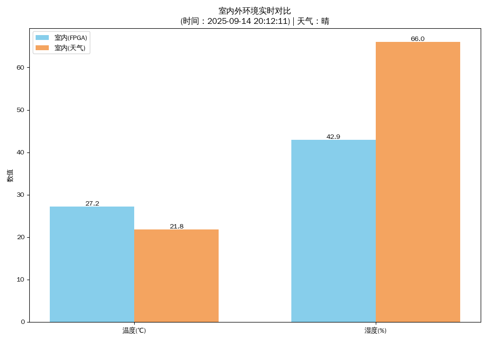

# Python-Virtual-FPGA-Lab-Linux-IoT-Data-Pipeline
# Python 虚拟FPGA与IoT数据管道

这是一个在 Linux 环境下，使用 Python 全栈技术模拟 IoT（物联网）设备数据采集、处理、与云端数据融合并进行可视化的项目。项目通过 `socat` 工具创建虚拟串口，模拟了真实的硬件数据流，旨在完整地展示一个小型 IoT 应用的原型。

##  成果展示

下图展示了由FPGA模拟的室内温湿度，与通过网络爬虫获取的北京市气象局发布的室外温湿度的实时对比。



## 核心技能展示

* **Python 全栈开发**: 熟练运用 Python 进行脚本编写、数据处理和Web请求。
* **硬件模拟与通信**: 使用 `pyserial` 库模拟嵌入式设备通过串口发送和接收数据。
* **Web 爬虫**: 使用 `Selenium` 和 `BeautifulSoup4` 从 **JavaScript 动态加载** 的气象网站动态抓取实时天气数据。
* **数据清洗与分析**: 使用 `Pandas` 对原始数据进行结构化处理。
* **数据可视化**: 使用 `Matplotlib` 将FPGA模拟的室内数据与网络爬取的室外数据进行对比，并生成图表。
* **Linux/Unix 工具链**: 熟练使用 `socat` 等命令行工具构建复杂的虚拟数据链路，体现了对 Linux 环境的深入理解。
* **远程开发**: 采用 **SSH 远程开发** 的工作流，模拟了无头设备（如树莓派）的真实开发场景

##  开发过程中的挑战与解决方案

### 1. 动态网页抓取: 从 `Requests` 到 `Selenium`
项目初期，我尝试使用 `requests` 库直接获取目标气象网站的 HTML。在分析返回内容时，发现无法找到关键的温湿度数据标签。
* **问题分析**: 经过浏览器开发者工具的检查，我确认了该网站的数据是通过 JavaScript 在页面加载后**动态渲染**的。`requests` 只能获取静态的 HTML 骨架，无法执行 JS。
* **解决方案**: 为了解决这个问题，我将爬虫方案切换为 `Selenium`。通过驱动一个无头 (headless) Chrome 浏览器，`Selenium` 能够完整地模拟用户访问、等待 JS 执行完毕，从而获取到包含所有动态数据的最终页面源码，成功解决了数据抓取的问题。在此过程中，我也实践了设置 `User-Agent` 等请求头来模拟真实浏览器行为的技巧。

### 2. 模拟嵌入式Linux开发环境
为了使项目更贴近真实的嵌入式（如树莓派）开发流程，我采用了 **主机 VS Code 通过 SSH 连接 Ubuntu 虚拟机** 的方式进行全程开发。
* **工作流**: 这种远程开发模式让我能够在一个轻量级的、无图形界面的 Linux 环境中运行和调试代码，而所有的代码编写和版本控制则在体验更好的主机上完成。
* **技能体现**: 这个过程锻炼了我对 Linux 命令行的熟练使用、SSH 远程连接的配置以及跨平台开发环境的管理能力。

### 3. 解决环境版本兼容性问题
在开发过程中，我遇到了由第三方库版本不同导致的语法不兼容问题，通过查阅官方文档和实践，成功找到了解决方案。
* **Matplotlib 可视化**: 在尝试为柱状图添加数值标签时，最初使用的便捷函数 `ax.bar_label()` 在我的虚拟机环境中报错。经查证，这是由于环境中 `Matplotlib` 的版本低于 3.4.0 所致。最终，我通过编写 `for` 循环和调用更底层的 `ax.text()` 函数，手动计算坐标并添加文本，实现了一个功能相同且向后兼容的解决方案。
* **Selenium 驱动配置**: 在配置 `Selenium` 的浏览器驱动时，我注意到了新旧版本语法的差异。旧版本直接使用 `executable_path` 参数，而在新版本中，官方推荐使用 `Service` 对象来管理驱动。这让我对管理项目依赖和注意库版本迭代的重要性有了更深刻的认识。

## 项目工作流程

本项目由三个独立的进程协同工作，模拟了一个真实的物联网场景：

```
+------------------+     (写入)     +---------------------------+     (读取)     +--------------------+
|                  |--------------->|                           |--------------->|                    |
|  mock_fpga.py    |                |  socat 虚拟串口 (/dev/pts)  |                | main_pipeline.py   |
| (模拟硬件数据源)  | <---------------|      (虚拟数据线)         | <---------------| (数据接收与处理端) |
|                  |     (读取)     |                           |     (写入)     |                    |
+------------------+                +---------------------------+                +--------------------+
                                                                                       |
                                                                                       | (处理、爬取、合并)
                                                                                       V
                                                                                +--------------------+
                                                                                |                    |
                                                                                |  生成对比图表.png   |
                                                                                |                    |
                                                                                +--------------------+

```

##  如何在 Ubuntu 虚拟机中运行

### 1. 环境准备

首先，克隆本项目并安装所有依赖。

```bash
# 克隆仓库
git clone [https://github.com/wushir828/Your-Repo-Name.git](https://github.com/wushir828/Your-Repo-Name.git)
cd Your-Repo-Name

#创建并激活虚拟环境
python3 -m venv venv
source venv/bin/activate

# 安装 Python 依赖库
pip install -r requirements.txt

# (如果需要) 安装 Google Chrome 和 ChromeDriver 以支持 Selenium
# 请根据你的 Ubuntu 版本自行搜索安装方法
```

### 2. 运行项目

你需要打开 **三个** 独立的终端窗口。

**窗口 1: 启动 `socat` 虚拟数据线**
```bash
# 创建一对相互连接的虚拟串口，例如 /dev/pts/6 和 /dev/pts/7
socat -d -d pty,raw,echo=0 pty,raw,echo=0
```
*记下它输出的两个串口号。*

**窗口 2: 启动主程序 (数据接收端)**
*打开 `main_pipeline.py` 文件，将其中的串口号修改为 `socat` 创建的其中一个 (例如 `/dev/pts/7`)。*
```bash
python3 main_pipeline.py
```
*程序会在这里等待，直到接收到数据。*

**窗口 3: 启动虚拟 FPGA (数据发送端)**
*打开 `mock_fpga.py` 文件，将其中的串口号修改为 `socat` 创建的另一个 (例如 `/dev/pts/6`)。*
```bash
python3 mock_fpga.py
```
*可以看到它开始规律地发送模拟温湿度数据。同时，窗口2的程序会接收到数据并开始执行后续的爬虫和可视化任务。*

##  项目文件结构

```
.
├── mock_fpga.py          # 模拟FPGA数据发送的脚本
├── main_pipeline.py      # 主程序：接收、清洗、爬取、合并、可视化
└── requirements.txt      # Python 依赖库列表
```